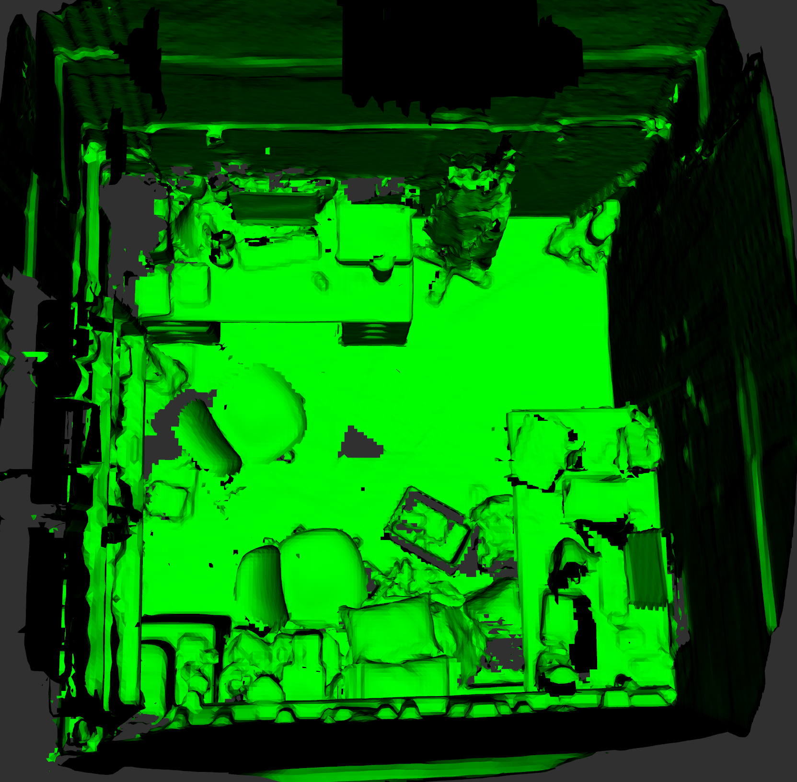
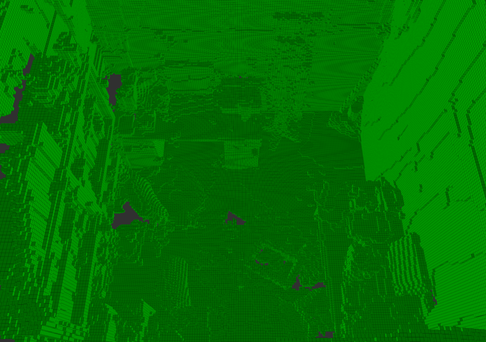

# ROS2-VDBFusion: Flexible and Efficient TSDF Integration

A standalone ROS2 C++ package that wraps the [vdbfusion](https://github.com/PRBonn/vdbfusion) library for flexible and efficient TSDF Integration.

Modified from the original ROS1 library [vdbfusion_ros](https://github.com/PRBonn/vdbfusion) and main [vdbfusion](https://github.com/PRBonn/vdbfusion) library.

## List of modifications
1. Added the original vdbfusion library to this package, allowing for the package to be built using colcon
2. Build the original library with ROS pre-installed OpenVDB [PRBonn/vdbfusion#43](https://github.com/PRBonn/vdbfusion/pull/43)
3. Ported the original ROS1 C++ wrapper to ROS2, with the following changes:
    - Updated the helper functions for converting and preprocessing PointCloud2 messages
    - Removed the vdbfusion::Transform class, the node now relies on tf2 natively
    - Removed the saveVDBVolume service
    - Added parameters and functions to visualize the TSDF integration using RViz with the visualization_markers package
    - Rewrote the node and launch files to work as a ROS2 component node
4. Ported the launch file to ROS2, using composable nodes together with depth image proc to interface the original library with depth image streams

## Installation

### OpenVDB

```sh
# Install OpenVDB dependencies
sudo apt update && apt install --no-install-recommends -y \
    libblosc-dev \
    libboost-iostreams-dev \
    libboost-system-dev \
    libboost-system-dev \
    libeigen3-dev

# Install OpenVDB from openvdb-vendor
sudo apt update && sudo apt install --no-install-recommends -y ros-humble-openvdb-vendor
```

### VDBfusion

*VDBFusion is now built alongside the ROS2 package using colcon*

### ROS

For now only [ROS Humble](https://docs.ros.org/en/humble/index.html) has been tested.  

As an extra dependency install: `sudo apt install ros-humble-tf2-sensor-msgs`.
On your catkin workspace, clone the vdbfusion_ros:

```sh
cd colcon_ws/src/
git clone https://github.com/PRBonn/vdbfusion_ros.git
colcon build 
```

## Usage

### Configuration

1. Create a config file compatible with your dataset and desired tsdf integration parameters using this [default configuration](/config/default.yaml)
2. Create a launch file using the [default launch file](/launch/vdbfusion_ros2.launch.py) the depth image topic name for the depth-image-proc node can be changed
```Python
    remappings=[
        ('image_rect', '/camera/depth/image_raw'), # change the /camera/depth/image_raw to your depth image topic
        ('camera_info', '/camera/depth/camera_info'), # change the /camera/depth/camera_info to your depth camera info topic
        ('points', '/input/pointcloud') 
    ]
```
3. The data can be published either through a rosbag file or directly from another ros node

### Launch

```sh
ros2 launch vdbfusion_ros2 vdbfusion_ros2.launch.py
```

### Visualize the VDB grid and mesh using Rviz
By default, the TSDF grid is published to /output/tsdf and the mesh is published to /output/mesh. This was tested on the [SceneNN dataset](https://github.com/hkust-vgd/scenenn).

Below images show Sequence 78 with voxel size set to 0.02 and truncation distance set to 0.06. 




The mesh and tsdf marker colours can be changed in the [vdbfusion_node.cpp](/src/vdbfusion_ros2/vdbfusion_node.cpp) file in the vdbVolumeToCubeMarker() and vdbVolumeToMeshMarker() functions.

## Dataset Examples

Download the dataset rosbag files from the respective links and modify the launch and config files.

### [TU Munich RGB-D SLAM Dataset and Benchmark - FR1DESK2](https://vision.in.tum.de/data/datasets/rgbd-dataset)

<!-- - Use the sample [config file](config/FR2Desk2.yaml) provided for this dataset -->

### [ETH Zurich ASL: Cow and Lady RGBD Dataset](https://projects.asl.ethz.ch/datasets/doku.php?id=iros2017)

<!-- - Use the sample [config file](config/CowAndLady.yaml) provided for this dataset -->

### [KITTI Dataset](http://www.cvlibs.net/datasets/kitti/raw_data.php)

<!-- - Convert the dataset into a rosbag file using [kitti2bag](https://github.com/tomas789/kitti2bag)
- Use the sample [config file](config/KITTI.yaml) provided for this dataset -->

Run the [launch](README.md#launch) command with your custom launch file and use ```ros2 bag play [PATH_TO_YOUR_ROSBAG]``` to start your ros2bag

## Citation

If you use this library for any academic work, please cite the original [paper](https://www.ipb.uni-bonn.de/wp-content/papercite-data/pdf/vizzo2022sensors.pdf).

```bibtex
@article{vizzo2022sensors,
  author         = {Vizzo, Ignacio and Guadagnino, Tiziano and Behley, Jens and Stachniss, Cyrill},
  title          = {VDBFusion: Flexible and Efficient TSDF Integration of Range Sensor Data},
  journal        = {Sensors},
  volume         = {22},
  year           = {2022},
  number         = {3},
  article-number = {1296},
  url            = {https://www.mdpi.com/1424-8220/22/3/1296},
  issn           = {1424-8220},
  doi            = {10.3390/s22031296}
}
```
